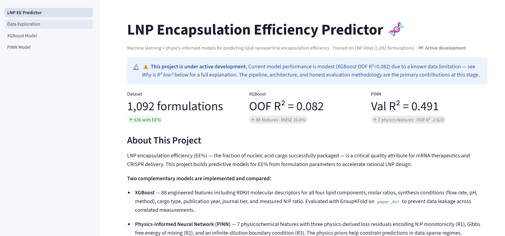

# LNP-EE Predictor

Machine learning and physics-informed neural network pipeline for predicting **lipid nanoparticle (LNP) encapsulation efficiency (EE%)** from formulation parameters and molecular descriptors.

Trained on the open-source [LNP Atlas](https://lnp-atlas.kisti.re.kr/) dataset — 1,092 LNP formulations curated from peer-reviewed literature.

**Status:** Active development. XGBoost baseline and PINN complete with unified GroupKFold evaluation. Expanding PINN dataset and adding API endpoint planned.

**[Live demo →](https://lipid-nanoparticle-ee-predictor.streamlit.app/)**

---

## Motivation

Encapsulation efficiency is one of the first go/no-go metrics in LNP development, yet it is measured empirically for nearly every new formulation. Predictive models could accelerate screening by rank-ordering candidate formulations before synthesis, reducing the number of wet-lab iterations needed to reach a high-EE lead.

The central challenge is data. Published LNP literature is heterogeneous — different labs report different subsets of formulation parameters, assay conditions vary, and EE values can reflect different measurement protocols. This project explores two complementary strategies for learning from that limited, noisy data: a high-capacity gradient-boosted tree model that extracts signal from rich feature engineering, and a physics-informed neural network that uses first-principles constraints to compensate for small labeled datasets.

---

## Results

| Model | OOF R² | OOF RMSE | Rows | Features | CV Strategy | Notes |
|---|---|---|---|---|---|---|
| XGBoost | -0.032 | 21.88% | 636 | 88 | GroupKFold (paper DOI) | Honest cross-paper generalization |
| PINN (7-feat, GroupKFold) | 0.438 | 11.25% | 93 | 7 | GroupKFold (paper DOI) | Physics residuals R1–R3 |
| PINN (7-feat, random split) | 0.580 | 10.12% | 93 | 7 | Random 80/20 | Optimistic — paper leakage possible |

> **Data update (March 2026):** Dataset expanded from 523 → 636 rows by fixing 174 rows with corrupt ± encoding and parsing range-formatted and dual-assay EE values. 6 broken cKK-E12 SMILES corrected via PubChem (CID 71555845). 32 DSPE-2armPEG2000 SMILES nulled due to valence error (falls back to frequency encoding). Cleaned data saved as `data/lnp_atlas_cleaned.csv`.



### Why does XGBoost R² drop from 0.136 to -0.032?

The previous 0.136 result included a data leakage bug: `encapsulation_efficiency_clean` (the target column) was inadvertently retained as an input feature after the EE cleaning step, inflating performance. The -0.032 result is the honest number with the leak removed.

Both the XGBoost and PINN results reveal the same fundamental challenge: **cross-paper generalization from heterogeneous LNP literature is hard.** Root cause analysis:

- Within-paper EE variance ≈ between-paper EE variance (both ~0.02 in fraction units)
- ~50% of EE variance is explained by unmeasured paper-level confounders: measurement protocol (RiboGreen vs. SpectraMax), buffer composition, operator technique, and lipid lot variability
- The 88 physicochemical formulation features don't uniquely identify experimental conditions across labs

This is not a model failure — it is a fundamental data limitation that would affect any ML approach trained on this dataset. **The PINN's physics priors provide meaningful benefit** (OOF RMSE 11.25% vs 21.88% for XGBoost) by constraining predictions to physically plausible regions even when data signal is weak.

### Honest interpretation

Both models are evaluated under **GroupKFold on `paper_doi`** — the hardest and most realistic split. Negative XGBoost R² means the model is less predictive than naively guessing the mean; this is honest and expected given the data structure.

**Intended use:** rank-ordering candidate formulations to reduce experimental screening burden, not as a precision measurement substitute. Performance is expected to improve substantially with standardized experimental data (same protocol, same assay) from a single lab.

---

## Models

### XGBoost Baseline

The baseline model applies gradient boosting to a rich feature representation of the LNP formulation.

- **636 rows** with EE% from the LNP Atlas; **88 features** spanning:
  - RDKit molecular descriptors (MW, LogP, TPSA, rotatable bonds, H-bond donors/acceptors) for each of four lipid components
  - Molar ratio parsing from strings such as `"50:1.5:38.5:10"`
  - Synthesis conditions extracted from free text (flow rate, flow ratio, buffer pH)
  - Interaction features: `IL_LogP × ratio_ionizable`, `PEG_MW × ratio_peg`
  - One-hot encoding for target cargo type and synthesis method; frequency-rank encoding for lipid names
  - Ordinal cargo difficulty score
- **GroupKFold(n_splits=5) on `paper_doi`** prevents data leakage from correlated same-paper formulations
- **Optuna 50-trial hyperparameter search** over 8 XGBoost hyperparameters (RMSE objective)
- **SHAP** values computed for all training samples; top-10 feature importances saved to `metadata.json`
- High-EE classification (threshold ≥80%): Precision=0.867, Recall=0.561, F1=0.681

### PINN (Physics-Informed Neural Network)

The PINN is the primary active development focus. It augments a supervised MSE loss with physics residuals derived from lipid self-assembly thermodynamics, with the goal of improving generalization from the small labeled datasets typical in LNP literature.

#### Input features

| Feature | Derivation |
|---|---|
| `ionizable_lipid_mole_fraction` | IL / total lipid, parsed from molar ratio string |
| `np_ratio` | N/P proxy = x_IL × 10 |
| `particle_size_nm` | DLS Z-average diameter |
| `pdi` | Polydispersity index |
| `zeta_mv` | Zeta potential (mV) |
| `peg_fraction` | PEG-lipid mole fraction |
| `cholesterol_fraction` | Cholesterol mole fraction |

#### Physics residuals

Three physics-informed loss terms constrain the model to physically plausible predictions, enforced via automatic differentiation through the network:

| Residual | Physical Principle | Reference |
|---|---|---|
| **R1** N/P monotonicity | EE increases with N/P ratio in the charge-limited regime (N/P < ~6); penalizes negative dEE/dNP below this threshold | Kulkarni et al., *ACS Nano* 2018; Kulkarni et al., *Nanoscale* 2019 |
| **R2** Thermodynamic mixing | Sign of dEE/dx_IL constrained by Gibbs free energy of ideal binary mixing: ΔG_mix = RT[x·ln(x) + (1−x)·ln(1−x)]; penalty applied when predicted gradient disagrees with thermodynamic expectation | Jayaraman et al., *Angew. Chem.* 2012 |
| **R3** Boundary condition | EE → 0 as particle size → ∞ (infinite dilution / failure of self-assembly); enforced via a synthetic boundary point during each training step | — |

Training objective: `L_total = L_data + 0.3 · (0.5·R1 + 0.5·R2 + 0.1·R3)`

#### Architecture

```
Input (7 features)
    |
Linear -> LayerNorm -> GELU          [input projection]
    |
[ResidualBlock x 3]                  [skip-connected MLP trunk]
    |
Linear -> GELU -> Linear -> Sigmoid  [output head, EE in [0, 1]]
```

Each ResidualBlock: `LayerNorm -> Linear -> GELU -> Linear`, with a skip connection summed before the next block. The sigmoid output enforces EE in [0, 1] by construction.

---

## Project Structure

```
lnp-ee-predictor/
|-- src/
|   |-- features.py       # Feature engineering pipeline (88 features)
|   |-- train.py          # XGBoost: Optuna + GroupKFold + SHAP
|   `-- train_pinn.py     # Entry point for PINN training
|-- pinn/
|   |-- model.py          # EEPredictor: ResidualBlock MLP, sigmoid output
|   |-- physics.py        # Physics residuals R1, R2, R3 and total_physics_loss()
|   |-- preprocess.py     # Feature engineering and LNP Atlas adapter
|   `-- train.py          # PINN training loop
|-- api/
|   `-- main.py           # FastAPI REST service (XGBoost backend)
|-- notebooks/
|   `-- analysis.ipynb    # EDA, SHAP plots, model explainability
|-- tests/
|   `-- test_pipeline.py
|-- artifacts/            # Saved models, SHAP values (gitignored)
|-- data/                 # LNP Atlas dataset (included for reproducibility)
|-- Dockerfile
|-- docker-compose.yml
`-- requirements.txt
```

---

## Quickstart

### Install dependencies

```bash
pip install -r requirements.txt
```

### Train XGBoost

```bash
python src/train.py
```

### Train PINN

```bash
# Recommended: GroupKFold evaluation (results reported in README)
python -m pinn.train --data data/lnp_atlas_cleaned.csv --cv groupkfold --epochs 300 --alpha 0.3 --out artifacts/pinn

# Quick run (random 80/20 split, optimistic R²):
python src/train_pinn.py
```

### Run the API

```bash
uvicorn api.main:app --reload --port 8000
# Interactive docs: http://localhost:8000/docs
```

### Docker

```bash
docker-compose up --build
```

---

## API Reference

The REST API serves the XGBoost model. All fields are optional; missing features are imputed with training-set medians stored in `artifacts/metadata.json`.

### POST /predict

```bash
curl -X POST http://localhost:8000/predict \
  -H "Content-Type: application/json" \
  -d '{
    "ionizable_lipid": "ALC-0315",
    "peg_lipid": "ALC-0159",
    "sterol_lipid": "cholesterol",
    "helper_lipid": "DSPC",
    "lipid_molar_ratio": "46.3:9.4:42.7:1.6",
    "target_type": "mRNA",
    "particle_size_nm": 80,
    "pdi": 0.10,
    "synthesis_method": "microfluidic",
    "buffer_ph": 4.0
  }'
```

**Response:**

```json
{
  "predicted_ee_percent": 84.3,
  "is_high_ee": true,
  "confidence_note": "High confidence — most features provided"
}
```

### Other endpoints

| Endpoint | Method | Description |
|---|---|---|
| `/predict/batch` | POST | Batch predictions for multiple formulations |
| `/model/info` | GET | Model metadata and top feature importances |
| `/health` | GET | Liveness check |

---

## Known Limitations

- **PINN dataset size**: Only 93 of 1,092 LNP Atlas records have all 7 required features (zeta potential is the binding constraint — reported in fewer than 20% of EE-labeled rows). Performance is expected to improve substantially with >300 labeled, complete records.
- **Cross-paper generalization**: Both models struggle to generalize across papers under GroupKFold. The PINN subset contains only 7 unique papers, with 3 papers contributing 77 of 93 rows — fold-level R² is highly variable.
- **Custom lipids**: Lipids without SMILES strings fall back to frequency-rank encoding, which carries no structural information. Novel scaffolds are a known weakness.
- **N/P ratio approximation**: True N/P requires cargo concentration, which is inconsistently reported. The proxy (x_IL × 10) introduces noise into R1 enforcement.
- **No biological activity**: EE% is necessary but not sufficient for transfection potency. Delivery efficacy in cells is not predicted.
- **Heteroscedasticity**: EE variance is higher in the mid-range (40-70%) than at the extremes. Box-Cox transform is applied to the XGBoost target; variance-weighted loss for the PINN is planned.

---

## Roadmap

- [x] XGBoost baseline: GroupKFold + Optuna + SHAP
- [x] PINN: ResidualBlock MLP with physics residuals R1 (N/P monotonicity), R2 (thermodynamic mixing), R3 (boundary condition)
- [x] Heteroscedasticity correction: Box-Cox target transform on XGBoost
- [x] Unified evaluation: PINN under GroupKFold for direct comparison with XGBoost
- [ ] Expand PINN dataset: impute missing zeta potential or relax the feature requirement
- [ ] REST API endpoint for PINN inference (currently XGBoost only)
- [ ] Transformer / attention architecture for formulation-level sequence modeling

---

## Citation

If you use this code or the underlying dataset, please cite the LNP Atlas:

> Song, S., Baek, J., & Seo, S. "LNP Atlas: A Comprehensive Dataset of Lipid Nanoparticle Compositions and Properties for Nucleic Acid Delivery." *Nature Nanotechnology* (2025). https://www.nature.com/articles/s41597-025-06456-w

Physics residual references:

> Kulkarni, J. A. et al. "On the formation and morphology of lipid nanoparticles containing ionizable cationic lipids and siRNA." *ACS Nano* 12, 4787–4795 (2018).

> Kulkarni, J. A. et al. "Lipid Nanoparticle Technology for Clinical Translation of siRNA Therapeutics." *Nanoscale* 11, 21733–21739 (2019).

> Jayaraman, M. et al. "Maximizing the Potency of siRNA Lipid Nanoparticles for Hepatic Gene Silencing In Vivo." *Angewandte Chemie International Edition* 51, 8529–8533 (2012).

---

## Author

Wesley Gilbert — BS Biophysics, Scientific Computing
[wesley-j-gilbert.com](https://www.wesley-j-gilbert.com)

## License

MIT
